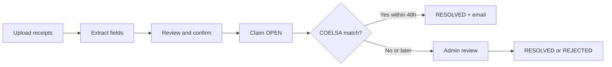

## What you'll accomplish

**Claims** (Reclamos) let you report **Argentina bank transfer receipts** when an inbound payment does not appear in your HG.cash transaction list—or when you need HG.cash to review the evidence and match it to the correct account.

In the HG.cash dashboard (**Claims** in the sidebar), you can:

- **Create** a claim by uploading up to **5** receipt images or PDFs per submission
- **Review extracted fields** (COELSA code, operation number, amount, origin/destination) before submitting
- **Track status** and comment history for each claim
- **Receive email** when a claim is automatically matched to a transaction by COELSA code

HG.cash operations can **review**, change status, add internal comments, and (for scoped admins) filter claims by user or account. Claims are a **dashboard workflow**—there is no public REST API for creating or managing claims.

## Overview

| Step | Who | What happens |
| --- | --- | --- |
| **Prepare** | Merchant user or admin | Files upload to temporary storage; HG.cash extracts structured data from Argentine transfer receipts (COELSA, operation number, amount, from/to). |
| **Confirm** | Same | You confirm or edit fields, optionally link an **account**, and the claim is stored with evidence in the `claims` storage bucket. |
| **Auto-match** | System (production) | Every ~20 minutes, **OPEN** or **UNDER_REVIEW** claims from the last **48 hours** with a valid **COELSA** code are matched to the latest transaction with the same code. |
| **Manual review** | HG.cash admin | Status updates and comments when auto-match does not apply or needs human judgment. |

Claims focus on **Argentina (ARS)** transfer comprobantes. The COELSA identification code (22 alphanumeric characters when present) is the primary key for automatic reconciliation.

## Claim statuses

| Status | Meaning |
| --- | --- |
| `OPEN` | Submitted and waiting for automatic match or admin action. |
| `UNDER_REVIEW` | Under active review by HG.cash. |
| `RESOLVED` | Closed successfully—often after a transaction was found by COELSA match or manual resolution. |
| `REJECTED` | Not accepted (invalid evidence, duplicate, or other reason noted in comments). |

Status changes and comments are timestamped in the claim history. Admins can add comments without changing status.

## What gets stored on each claim

Each claim record can include:

- **Evidence file** — image or PDF in secure storage (viewable via time-limited signed URLs in the dashboard)
- **COELSA code** and **operation number** — as read from the receipt or entered by you
- **Amount** and **currency** (defaults to ARS when extracted)
- **Extracted data** — structured origin/destination hints (`from`, `to`)
- **Linked account** — optional account you associate at creation (admins must have scope for that account)
- **Transaction link** — set when a matching inbound transaction is found

## Roles and access

| Role | Typical capabilities |
| --- | --- |
| **USER** | Create claims (prepare → confirm), list own claims, view own receipt files and comments. |
| **ADMIN** | List claims for allowed accounts, filter by user/account/status, update status, add comments, export (when **CAN_EXPORT** is enabled). |
| **Scoped admin** | Same as admin, limited to **allowed accounts** (direct claim account or transaction account). |

The **Claims** section must be enabled for your user (`canAccessClaims`). If you do not see **Claims** in the sidebar, contact HG.cash support.

## Automatic reconciliation

In production, a scheduled job runs approximately **every 20 minutes**:

1. Selects claims in `OPEN` or `UNDER_REVIEW` created in the last **48 hours** with a non-empty **COELSA** code.
2. Finds the latest non-deleted **Transaction** with the same COELSA code (case-insensitive).
3. Sets the claim to **`RESOLVED`**, appends a system comment with the transaction ID, and sends a **claim matched** email when your user email is on file.

If no transaction exists yet, leave the claim **OPEN**—matching can succeed once the inbound transfer is ingested. For older claims or missing COELSA on the receipt, rely on **admin review**.

## When to use a claim

Use Claims when:

- A payer sent an **ARS bank transfer** to your HG.cash account but you do not see the credit yet
- You have a **comprobante** (screenshot or PDF) with COELSA or operation details
- You need HG.cash to **trace or associate** the payment with a specific account

Claims are **not** a substitute for **Checkouts** hosted payment pages or the **REST API** for programmatic pay-ins. For Brazil PIX or Chile PayRetailers flows, use the product areas documented under **Countries** and **Checkouts**.

## Before you begin

- **Access** to **Claims** in the dashboard
- Receipt files in **image** or **PDF** format (max **5** per submission)
- **COELSA code** on the receipt when possible—it greatly speeds up automatic resolution
- For admins: clarity on which **account** the transfer was intended for when linking at creation

For payment collection with hosted pages and webhooks, see **[Checkouts](/checkouts/introduction)**. For inbound transfer rails by country, see **[Countries](/countries/introduction)**.
