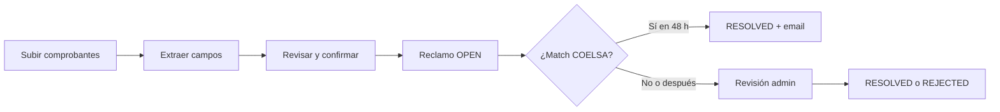

## Lo que vas a lograr

**Reclamos** te permiten informar **comprobantes de transferencias bancarias en Argentina** cuando un pago entrante no aparece en tu listado de transacciones de HG.cash — o cuando necesitás que HG.cash revise la evidencia y la asocie a la cuenta correcta.

En el panel de HG.cash (**Reclamos** en la barra lateral) podés:

- **Crear** un reclamo subiendo hasta **5** imágenes o PDFs por envío
- **Revisar los campos extraídos** (código COELSA, número de operación, monto, origen/destino) antes de confirmar
- **Seguir el estado** y el historial de comentarios de cada reclamo
- **Recibir un email** cuando un reclamo se vincula automáticamente a una transacción por código COELSA

El equipo de HG.cash puede **revisar**, cambiar el estado, agregar comentarios internos y (para administradores con alcance) filtrar por usuario o cuenta. Los reclamos son un flujo del **panel** — no hay API REST pública para crearlos ni gestionarlos.

## Resumen

| Paso | Quién | Qué ocurre |
| --- | --- | --- |
| **Prepare** | Usuario comercio o admin | Los archivos se suben a almacenamiento temporal; HG.cash extrae datos estructurados del comprobante argentino (COELSA, operación, monto, desde/hacia). |
| **Confirm** | Mismo | Confirmás o editás campos, opcionalmente vinculás una **cuenta**, y el reclamo queda guardado con evidencia en el bucket `claims`. |
| **Match automático** | Sistema (producción) | Cada ~20 minutos, reclamos **OPEN** o **UNDER_REVIEW** de las últimas **48 horas** con **COELSA** válido se emparejan con la última transacción con el mismo código. |
| **Revisión manual** | Admin HG.cash | Cambios de estado y comentarios cuando el match automático no aplica o requiere criterio humano. |

Los reclamos están orientados a **comprobantes de transferencia ARS en Argentina**. El código COELSA (22 caracteres alfanuméricos cuando está presente) es la clave principal para la conciliación automática.

## Estados del reclamo

| Estado | Significado |
| --- | --- |
| `OPEN` | Enviado; esperando match automático o acción del admin. |
| `UNDER_REVIEW` | En revisión activa por HG.cash. |
| `RESOLVED` | Cerrado correctamente — a menudo tras encontrar la transacción por COELSA o resolución manual. |
| `REJECTED` | No aceptado (evidencia inválida, duplicado u otro motivo en comentarios). |

Los cambios de estado y comentarios quedan registrados con marca de tiempo. Los admins pueden agregar comentarios sin cambiar el estado.

## Datos guardados en cada reclamo

Cada registro puede incluir:

- **Archivo de evidencia** — imagen o PDF en almacenamiento seguro (visible con URLs firmadas de duración limitada en el panel)
- **Código COELSA** y **número de operación** — leídos del comprobante o ingresados por vos
- **Monto** y **moneda** (por defecto ARS si se extrae)
- **Datos extraídos** — pistas estructuradas de origen/destino (`from`, `to`)
- **Cuenta vinculada** — cuenta opcional al crear (los admins deben tener alcance sobre esa cuenta)
- **Vínculo a transacción** — cuando se encuentra un ingreso coincidente

## Roles y acceso

| Rol | Capacidades habituales |
| --- | --- |
| **USER** | Crear reclamos (prepare → confirm), listar los propios, ver archivos y comentarios propios. |
| **ADMIN** | Listar reclamos de cuentas permitidas, filtrar por usuario/cuenta/estado, actualizar estado, comentar, exportar (con **CAN_EXPORT** habilitado). |
| **Admin con alcance** | Igual que admin, limitado a **cuentas permitidas** (cuenta del reclamo o de la transacción). |

La sección **Reclamos** debe estar habilitada (`canAccessClaims`). Si no ves **Reclamos** en la barra lateral, contactá a soporte de HG.cash.

## Conciliación automática

En producción, un job programado corre aproximadamente **cada 20 minutos**:

1. Toma reclamos en `OPEN` o `UNDER_REVIEW` de las últimas **48 horas** con **COELSA** no vacío.
2. Busca la última **Transaction** no eliminada con el mismo COELSA (sin distinguir mayúsculas/minúsculas).
3. Pasa el reclamo a **`RESOLVED`**, agrega un comentario de sistema con el ID de transacción y envía email de **reclamo conciliado** si hay email de usuario.

Si la transacción aún no existe, dejá el reclamo en **OPEN** — el match puede completarse cuando se ingeste el movimiento. Para reclamos más viejos o sin COELSA en el comprobante, dependé de la **revisión manual**.

## Cuándo usar un reclamo

Usá Reclamos cuando:

- Un pagador envió una **transferencia ARS** a tu cuenta HG.cash y no ves el crédito
- Tenés un **comprobante** (captura o PDF) con COELSA u operación
- Necesitás que HG.cash **rastree o asocie** el pago a una cuenta concreta

Los reclamos **no** reemplazan las **páginas de pago Checkouts** ni la **API REST** para cobros programáticos. Para PIX en Brasil o PayRetailers en Chile, ver **Países** y **Checkouts**.

## Antes de empezar

- **Acceso** a **Reclamos** en el panel
- Archivos en **imagen** o **PDF** (máximo **5** por envío)
- **Código COELSA** en el comprobante cuando sea posible — acelera mucho la resolución automática
- Para admins: claridad sobre la **cuenta** destino al vincular al crear

Para cobro con páginas hospedadas y webhooks, ver **[Checkouts](/es/checkouts/introduction)**. Para medios de ingreso por país, ver **[Países](/es/countries/introduction)**.
