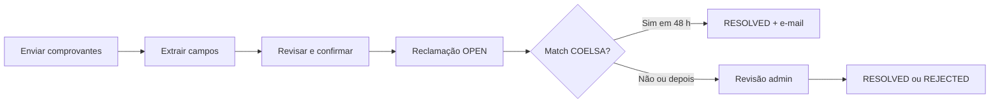

## O que você vai conseguir

**Reclamações** permitem informar **comprovantes de transferências bancárias na Argentina** quando um pagamento de entrada não aparece na sua lista de transações HG.cash — ou quando você precisa que a HG.cash revise a evidência e associe à conta correta.

No painel HG.cash (**Reclamações** na barra lateral), você pode:

- **Criar** uma reclamação enviando até **5** imagens ou PDFs por envio
- **Revisar campos extraídos** (código COELSA, número da operação, valor, origem/destino) antes de confirmar
- **Acompanhar status** e histórico de comentários de cada reclamação
- **Receber e-mail** quando uma reclamação for associada automaticamente a uma transação pelo código COELSA

A equipe HG.cash pode **revisar**, alterar status, adicionar comentários internos e (para admins com escopo) filtrar por usuário ou conta. Reclamações são um fluxo do **painel** — não há API REST pública para criá-las ou gerenciá-las.

## Visão geral

| Etapa | Quem | O que acontece |
| --- | --- | --- |
| **Prepare** | Usuário merchant ou admin | Arquivos vão para armazenamento temporário; a HG.cash extrai dados estruturados do comprovante argentino (COELSA, operação, valor, de/para). |
| **Confirm** | Mesmo | Você confirma ou edita campos, opcionalmente vincula uma **conta**, e a reclamação fica salva com evidência no bucket `claims`. |
| **Match automático** | Sistema (produção) | A cada ~20 minutos, reclamações **OPEN** ou **UNDER_REVIEW** das últimas **48 horas** com **COELSA** válido são pareadas com a última transação com o mesmo código. |
| **Revisão manual** | Admin HG.cash | Atualização de status e comentários quando o match automático não se aplica ou exige julgamento humano. |

Reclamações focam em **comprovantes de transferência ARS na Argentina**. O código COELSA (22 caracteres alfanuméricos quando presente) é a chave principal para conciliação automática.

## Status da reclamação

| Status | Significado |
| --- | --- |
| `OPEN` | Enviada; aguardando match automático ou ação do admin. |
| `UNDER_REVIEW` | Em revisão ativa pela HG.cash. |
| `RESOLVED` | Encerrada com sucesso — muitas vezes após encontrar a transação por COELSA ou resolução manual. |
| `REJECTED` | Não aceita (evidência inválida, duplicata ou outro motivo nos comentários). |

Mudanças de status e comentários ficam registrados com data/hora. Admins podem comentar sem alterar o status.

## O que fica armazenado em cada reclamação

Cada registro pode incluir:

- **Arquivo de evidência** — imagem ou PDF em armazenamento seguro (visualização via URLs assinadas de curta duração no painel)
- **Código COELSA** e **número da operação** — lidos do comprovante ou informados por você
- **Valor** e **moeda** (padrão ARS quando extraído)
- **Dados extraídos** — indícios estruturados de origem/destino (`from`, `to`)
- **Conta vinculada** — conta opcional na criação (admins precisam de escopo sobre essa conta)
- **Vínculo à transação** — quando um crédito correspondente é encontrado

## Papéis e acesso

| Papel | Capacidades típicas |
| --- | --- |
| **USER** | Criar reclamações (prepare → confirm), listar as próprias, ver arquivos e comentários próprios. |
| **ADMIN** | Listar reclamações das contas permitidas, filtrar por usuário/conta/status, atualizar status, comentar, exportar (com **CAN_EXPORT** habilitado). |
| **Admin com escopo** | Igual ao admin, limitado às **contas permitidas** (conta da reclamação ou da transação). |

A seção **Reclamações** precisa estar habilitada (`canAccessClaims`). Se não vir **Reclamações** na barra lateral, contate o suporte HG.cash.

## Conciliação automática

Em produção, um job agendado roda aproximadamente **a cada 20 minutos**:

1. Seleciona reclamações em `OPEN` ou `UNDER_REVIEW` das últimas **48 horas** com **COELSA** preenchido.
2. Encontra a última **Transaction** não excluída com o mesmo COELSA (sem diferenciar maiúsculas/minúsculas).
3. Define **`RESOLVED`**, adiciona comentário de sistema com o ID da transação e envia e-mail de **reclamação conciliada** quando houver e-mail do usuário.

Se a transação ainda não existir, mantenha a reclamação em **OPEN** — o match pode concluir quando o movimento for ingerido. Para reclamações mais antigas ou sem COELSA no comprovante, use **revisão manual**.

## Quando usar uma reclamação

Use Reclamações quando:

- Um pagador enviou **transferência ARS** para sua conta HG.cash e o crédito não aparece
- Você tem **comprovante** (captura ou PDF) com COELSA ou operação
- Precisa que a HG.cash **rastreie ou associe** o pagamento a uma conta específica

Reclamações **não** substituem **Checkouts** (páginas de pagamento hospedadas) nem a **API REST** para recebimentos programáticos. Para PIX no Brasil ou PayRetailers no Chile, veja **Países** e **Checkouts**.

## Antes de começar

- **Acesso** a **Reclamações** no painel
- Arquivos em **imagem** ou **PDF** (máximo **5** por envio)
- **Código COELSA** no comprovante quando possível — acelera muito a resolução automática
- Para admins: clareza sobre a **conta** destino ao vincular na criação

Para cobrança com páginas hospedadas e webhooks, veja **[Checkouts](/pt-BR/checkouts/introduction)**. Para meios de entrada por país, veja **[Países](/pt-BR/countries/introduction)**.
